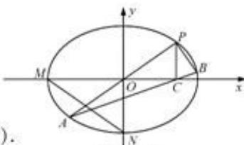

<!-- question-source:start -->
18. 本小题主要考查椭圆的标准方程及几何性质、直线方程、直线的垂直关系、点到直线的距离等基础知识，考查运算求解能力和推理论证能力。满分16分。
解：(1)由题设知， $a=2,b=\sqrt{2}$ ，故 $M(-2,0),N(0,-\sqrt{2})$ ，所以线段MN中点的坐标为 $(-1,-\frac{\sqrt{2}}{2})$ 。由于直线PA平分线段MN，故直线PA过线段MN的中点，又直线PA

$$
k = \frac {- \frac {\sqrt {2}}{2}}{- 1} = \frac {\sqrt {2}}{2}.
$$

$$
y = 2 x
$$

$$
\frac {x ^ {2}}{4} + \frac {4 x ^ {2}}{2} = 1
$$

$$
x = \pm \frac {2}{3}
$$

$$
P \left(\frac {2}{3}, \frac {4}{3}\right), A \left(- \frac {2}{3}, - \frac {4}{3}\right)
$$

(第18题)

于是 $C(\frac{2}{3},0)$ ，直线 AC 的斜率为 $\frac{0+\frac{4}{3}}{\frac{2}{3}+\frac{2}{3}}=1$ ，故直线 AB 的方程为 $x-y-\frac{2}{3}=0$ .
因此， $d=\frac{\left|\frac{2}{3}-\frac{4}{3}-\frac{2}{3}\right|}{\sqrt{1^{2}+1^{2}}}=\frac{2\sqrt{2}}{3}.$

(3)解法一:
将直线 PA 的方程 y=kx 代入 $\frac{x^{2}}{4}+\frac{y^{2}}{2}=1$ ，解得 $x=\pm\frac{2}{\sqrt{1+2k^{2}}}$ 。记 $\mu=\frac{2}{\sqrt{1+2k^{2}}}$ ，则 $P(\mu,\mu k)$ ， $A(-\mu,-\mu k)$ 。于是 $C(\mu,0)$ 。故直线 AB 的斜率为 $\frac{0+\mu k}{\mu+\mu}=\frac{k}{2}$ ，其方程为 $y=\frac{k}{2}(x-\mu)$ ，代入椭圆方程得 $(2+k^{2})x^{2}-2\mu k^{2}x-\mu^{2}(3k^{2}+2)=0$ ，解得 $x=\frac{\mu(3k^{2}+2)}{2+k^{2}}$ 或 $x=-\mu$ 。因此 $B(\frac{\mu(3k^{2}+2)}{2+k^{2}},\frac{\mu k^{3}}{2+k^{2}})$ 。
于是直线 PB 的斜率 $k_{1}=\frac{\frac{\mu k^{3}}{2+k^{2}}-\mu k}{\frac{\mu(3k^{2}+2)}{2+k^{2}}-\mu}=\frac{k^{3}-k(2+k^{2})}{3k^{2}+2-(2+k^{2})}=-\frac{1}{k}$ 因此 $k_{1}k=-1$ ，所以 $PA \perp PB$ .
解法二：
设 $P(x_{1},y_{1}), B(x_{2},y_{2})$ ，则 $x_{1}>0, x_{2}>0, x_{1}\neq x_{2}, A(-x_{1},-y_{1}), C(x_{1},0)$ 。设直线 PB，AB 的斜率分别为 $k_{1}, k_{2}$ 。因为 C 在直线 AB 上，所以 $k_{2}=\frac{0-(-y_{1})}{x_{1}-(-x_{1})}=\frac{y_{1}}{2x_{1}}=\frac{k}{2}$ 。从而 $k_{1}k+1=2k_{1}k_{2}+1=2\cdot\frac{y_{2}-y_{1}}{x_{2}-x_{1}}\cdot\frac{y_{2}-(-y_{1})}{x_{2}-(-x_{1})}+1$ $=\frac{2y_{2}^{2}-2y_{1}^{2}}{x_{2}^{2}-x_{1}^{2}}+1=\frac{(x_{2}^{2}+2y_{2}^{2})-(x_{1}^{2}+2y_{1}^{2})}{x_{2}^{2}-x_{1}^{2}}=\frac{4-4}{x_{2}^{2}-x_{1}^{2}}=0.$

因此 $k_{1}k=-1$ ，所以 $PA \perp PB$ .
<!-- question-source:end -->

![[高中/真题/按年份分类/2011/2011年江苏高考数学试题及答案/解答题/题目/answers/Q00026787A1.md]]
