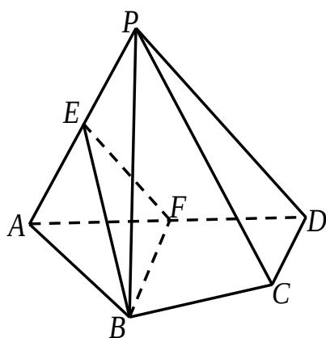

<!-- question-source:start -->
## 16. （本小题满分 14 分）

如图，在四棱锥 P-ABCD 中，平面 PAD⊥平面 ABCD，AB=AD， $\angle BAD=60^{\circ}$ ，E,F 分别是 AP,AD 的中点.

求证：
（1）直线 $EF / /$ 平面 $PCD$ ；

(2) 平面 BEF ⊥ 平面 PAD.
<!-- question-source:end -->

![[高中/真题/按年份分类/2011/2011年江苏高考数学试题及答案/解答题/题目/answers/Q00029705A1.md]]
