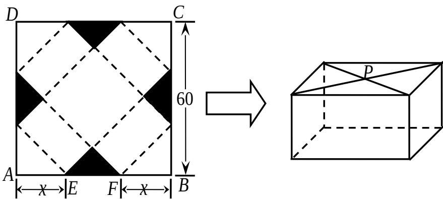

<!-- question-source:start -->
## 17. （本小题满分 14 分）

请你设计一个包装盒，如图所示，ABCD 是边长为 60cm 的正方形硬纸片，切去阴影部分所示的四个全等的等腰直角三角形，再沿虚线折起，使得 A, B, C, D 四个点重合于图中的点 P，正好形成一个正四棱柱形状的包装盒，E, F 在 AB 上，是被切去的一个等腰直角三角形斜边的两个端点．设 AE=FB=x（cm）．

(1) 某广告商要求包装盒的侧面积 $S(\mathrm{cm}^2)$ 最大, 试问 $x$ 应取何值?

(2) 某厂商要求包装盒的容积 $V(\mathrm{cm}^3)$ 最大, 试问 $x$ 应取何值? 并求出此时包装盒的高与底面边长的比值.

<!-- question-source:end -->

![[高中/真题/按年份分类/2011/2011年江苏高考数学试题及答案/解答题/题目/answers/Q00029706A1.md]]
