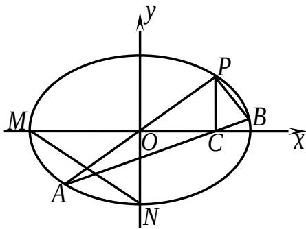

<!-- question-source:start -->
## 18. （本小题满分 16 分）

如图, 在平面直角坐标系 $xOy$ 中, $M, N$ 分别是椭圆 $\frac{x^2}{4} + \frac{y^2}{2} = 1$ 的顶点, 过坐标原点的直线交椭圆于 $P, A$ 两点, 其中点 $P$ 在第一象限, 过 $P$ 作 $x$ 轴的垂线, 垂足为 $C$ , 连接 $AC$ , 并延长交椭圆于点 $B$ . 设直线 $PA$ 的斜率

(1) 当直线 $PA$ 平分线段 $MN$ ，求 $k$ 的值；

(2) 当 k=2 时，求点 P 到直线 AB 的距离 d；

(3) 对任意 $k > 0$ ，求证： $PA \perp PB$ .
<!-- question-source:end -->

![[高中/真题/按年份分类/2011/2011年江苏高考数学试题及答案/解答题/题目/answers/Q00029707A1.md]]
