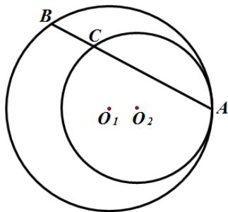

> [!faq]- 2011年江苏高考数学试题及答案解析
>
> > [!success]- **【答案】** 详见解析
>
> > [!note]- **【分析】**
> > 本题未单列分析。
>
> > [!note]- **【解析】**
> > 时应写出文字说明、证明过程或演算步骤.
> >
> > A. 选修4-1：几何证明选讲
> >
> > (本小题满分 10 分)
> >
> > 如图，圆 $O_{1}$ 与圆 $O_{2}$ 内切于点 $A$ ，其半径分别为 $r_1$ 与 $r_2$ （
> >
> > $r_{1}>r_{2}$ ）．圆 $O_{1}$ 的弦AB交圆 $O_{2}$ 于点C（ $O_{1}$ 不在AB上）.
> >
> > 
> >
> > 求证：AB:AC 为定值.
> >
> > B. 选修4-2：矩阵与变换
> >
> > (本小题满分 10 分)
> >
> > 已知矩阵 $A=\begin{bmatrix}1&1\\ 2&1\end{bmatrix}$ ，向量 $\beta=\begin{bmatrix}1\\ 2\end{bmatrix}$ 。求向量 $\alpha$ ，使得 $A^{2}\alpha=\beta$ 。
> >
> > C. 选修4-4：坐标系与参数方程
> >
> > (本小题满分 10 分)
> >
> > 在平面直角坐标系 $xOy$ 中，求过椭圆 $\left\{ \begin{array}{l} x = 5\cos \varphi \\ y = 3\sin \varphi \end{array} \right.$ （ $\varphi$ 为参数）的右焦点，且与直线
> >
> > \(\left\{ \begin{array}{ll}x = 4 - 2t & (t\) 为参数）平行的直线的普通方程.\\ y = 3 - t \end{array} \right.\)
> >
> > D. 选修4-5：不等式选讲
> >
> > (本小题满分 10 分)
> >
> > 解不等式: $x + |2x - 1| < 3$
> >
> > 【必做题】第22题、第23题，每题10分，共计20分．请在
> >
> > 答题卡指定区域内作答，解答时应写出文字说
> >
> > 明、证明过程或演算步骤.
