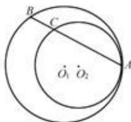

> [!faq]- 2011年江苏高考数学试题及答案解析
>
> > [!success]- **【答案】** 详见解析
>
> > [!note]- **【分析】**
> > 探究及逻辑推理的能力. 满分 16 分.
>
> > [!note]- **【解析】**
> > 分析探究及逻辑推理的能力. 满分 16 分.
> >
> > 解：(1)由题设知，当 $n \geqslant 2$ 时， $S_{n+1} + S_{n-1} = 2(S_n + S_1)$ ，即 $(S_{n+1} - S_n) - (S_n - S_{n-1}) = 2S_1$ . 从而 $a_{n+1} - a_n = 2a_1 = 2$ . 又 $a_2 = 2$ ，故当 $n \geqslant 2$ 时， $a_n = a_2 + 2(n-2) = 2n-2$ . 所以 $a_5$ 的值为8.
> >
> > (2)由题设知，当 $k \in M = \{3, 4\}$ 且 $n > k$ 时， $S_{n+k} + S_{n-k} = 2S_n + 2S_k$ 且 $S_{n+1+k} + S_{n+1-k} = 2S_{n+1} + 2S_k$ ，两式相减得 $a_{n+1+k} + a_{n+1-k} = 2a_{n+1}$ ，即 $a_{n+1+k} - a_{n+1} = a_{n+1} - a_{n+1-k}$ . 所以当 $n \geqslant 8$ 时， $a_{n-6}, a_{n-3}, a_n, a_{n+3}, a_{n+6}$ 成等差数列，且 $a_{n-6}, a_{n-2}, a_{n+2}, a_{n+6}$ 也成等差数列. 从而当 $n \geqslant 8$ 时， $2a_n = a_{n+3} + a_{n-3} = a_{n+6} + a_{n-6}$ ，（\*）且 $a_{n+6} + a_{n-6} = a_{n+2} + a_{n-2}$ . 所以当 $n \geqslant 8$ 时， $2a_n = a_{n+2} + a_{n-2}$ ，即 $a_{n+2} - a_n = a_n - a_{n-2}$ . 于是当 $n \geqslant 9$ 时， $a_{n-3}, a_{n-1}, a_{n+1}, a_{n+3}$ 成等差数列，从而 $a_{n+3} + a_{n-3} = a_{n+1} + a_{n-1}$ ，故由 (\*) 式知 $2a_n = a_{n+1} + a_{n-1}$ ，即 $a_{n+1} - a_n = a_n - a_{n-1}$ . 当 $n \geqslant 9$ 时，设 $d = a_n - a_{n-1}$ . 当 $2 \leqslant m \leqslant 8$ 时， $m + 6 \geqslant 8$ ，从而由 (\*) 式知 $2a_{m+6} = a_m + a_{m+12}$ ，故 $2a_{m+7} = a_{m+1} + a_{m+13}$ . 从而 $2(a_{m+7} - a_{m+6}) = a_{m+1} - a_m + (a_{m+13} - a_{m+12})$ ，于是 $a_{m+1} - a_m = 2d - d = d$ . 因此， $a_{n+1} - a_n = d$ 对任意 $n \geqslant 2$ 都成立. 又由 $S_{n+k} + S_{n-k} - 2S_n = 2S_k (k \in \{3, 4\})$ 可知 $(S_{n+k} - S_n) - (S_n - S_{n-k}) = 2S_k$ ，故 $9d = 2S_3$ 且 $16d = 2S_4$ . 解得 $a_4 = \frac{7}{2}d$ ，从而 $a_2 = \frac{3}{2}d$ ， $a_1 = \frac{d}{2}$ . 因此，数列 $|a_n|$ 为等差数列. 由 $a_1 = 1$ 知 $d = 2$ . 所以数列 $|a_n|$ 的通项公式为 $a_n = 2n-1$ .
> >
> > ## 数学Ⅱ（附加题）
> >
> > ## 21.【选做题】本题包括 A、B、C、D 四小题，请选定其中两题，并在相应的答题区域内作答。若多做，则按作答的前两题评分。
> >
> > 解答时应写出文字说明、证明过程或演算步骤.
> >
> > A. 选修4-1: 几何证明选讲
> >
> > (本小题满分10分)
> >
> > 如图，圆 $O_{1}$ 与圆 $O_{2}$ 内切于点 $A$ ，其半径分别为 $r_1$ 与 $r_2(r_1 > r_2)$ .圆 $O_{1}$ 的弦 $AB$ 交圆 $O_{2}$ 于点 $C(O_{1}$ 不在 $AB$ 上).求证： $AB:AC$ 为定值
> >
> > B. 选修4-2: 矩阵与变换 (本小题满分10分)
> >
> > 
> >
> > 已知矩阵 $A = \begin{bmatrix} 1 & 1 \\ 2 & 1 \end{bmatrix}$ ，向量 $\pmb{\beta} = \begin{bmatrix} 1 \\ 2 \end{bmatrix}$ . 求向量 $\alpha$ ，使得 $A^2\alpha = \beta$
> >
> > C. 选修4-4: 坐标系与参数方程
> >
> > (本小题满分10分)
> > 在平面直角坐标系 xOy 中，求过椭圆 $\left\{\begin{aligned}x=5\cos\varphi,\\ y=3\sin\varphi\end{aligned}\right.$ ( $\varphi$ 为参数) 的右焦点，且与直线 $\left\{\begin{aligned}x=4-2t,\\ y=3-t\end{aligned}\right.$ (t 为参数) 平行的直线的普通方程.
> >
> > D. 选修4-5: 不等式选讲
> > (本小题满分10分)
> > 解不等式 $x + |2x - 1| < 3$ .
> >
> > ## 【必做题】第22题、第23题，每题10分，共计20分.请在答题卡指定区域内作答，
> > 解答时应写出文字说明、证明过程或演算步骤.
