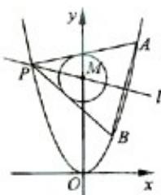

<!-- question-source:start -->
21、（2011·浙江）已知抛物线 $C_1: x^2 = y$ ，圆 $C_2: x^2 + (y - 4)^2 = 1$ 的圆心为点 $M$

（Ⅰ）求点 M 到抛物线 $C_{1}$ 的准线的距离；

（II）已知点 P 是抛物线 $C_{1}$ 上一点（异于原点），过点 P 作圆 $C_{2}$ 的两条切线，交抛物线 $C_{1}$ 于 A, B 两点，若过 M, P 两点的直线 I 垂足于 AB，求直线 I 的方程.

<!-- question-source:end -->

![[高中/真题/按年份分类/2011/2011年浙江高考数学_理科_试卷_含答案_/填空题/题目/answers/Q00023374A1.md]]
