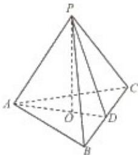

<!-- question-source:start -->
20、（2011·浙江）如图，在三棱锥 P-ABC 中，AB=AC，D 为 BC 的中点，PO⊥平面 ABC，垂足 O 落在线段 AD 上，已知 BC=8，PO=4，AO=3，OD=2

（Ⅰ）证明：AP⊥BC；

（II）在线段AP上是否存在点M，使得二面角A-MC- $\beta$ 为直二面角？若存在，求出AM的长；若不存在，请说明理由.
<!-- question-source:end -->

![[高中/真题/按年份分类/2011/2011年浙江高考数学_理科_试卷_含答案_/解答题/题目/answers/Q00023373A1.md]]
