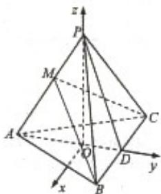

> [!faq]- 2011年浙江高考数学(理科)试卷(含答案)解析
>
> > [!success]- **【答案】** 详见解析
>
> > [!note]- **【分析】**
> > 以 O 为原点，以 AD 方向为 Y 轴正方向，以射线 OP 的方向为 Z 轴正方向，建立空间坐标系，我们易求出几何体中各个顶点的坐标.
>
> > [!note]- **【解析】**
> > 解：以O为原点，以AD方向为Y轴正方向，以射线OP的方向为Z轴正方向，建立空间坐标系，
> >
> > 则O（0，0，0），A（0，-3，0），B（4，2，0），C（-4，2，0），P（0，0，4）
> > (1) 则 $\stackrel{\rightarrow}{AP} = (0, 3, 4)$ ， $\stackrel{\rightarrow}{BC} = (-8, 0, 0)$
> >
> > 由此可得 $\vec{AP} \cdot \vec{BC} = 0$
> >
> > $$
> > \therefore \stackrel {\rightarrow} {A P} _ {\perp} \stackrel {\rightarrow} {B C}
> > $$
> >
> > 即 AP⊥BC
> >
> > (Ⅱ) 设 $\stackrel{\rightarrow}{PM} = \lambda \stackrel{\rightarrow}{PA}$ ， $\lambda \neq 1$ ，则 $\stackrel{\rightarrow}{PM} = \lambda$ (0, -3, -4)
> >
> > $$
> > \stackrel {\rightarrow} {B M} = \stackrel {\rightarrow} {B P} + \stackrel {\rightarrow} {P M} = \stackrel {\rightarrow} {B P} + \lambda \stackrel {\rightarrow} {P A} = (- 4, - 2, 4) + \lambda (0, - 3, - 4)
> > $$
> >
> > $$
> > \vec {A C} = (- 4, 5, 0), \vec {B C} = (- 8, 0, 0)
> > $$
> >
> > 设平面 BMC 的法向量 $\stackrel{\rightarrow}{a} = (a, b, c)$
> >
> > $$
> > \vec {B M} \cdot \vec {a} = 0
> > $$
> >
> > 则 $\vec{BC} \cdot \vec{a} = 0$
> >
> > $$
> > \left\{ \begin{array}{l} - 4 a - (2 + 3 \lambda) b + (4 - 4 \lambda) c = 0 \\ - 8 a = 0 \end{array} \right.
> > $$
> >
> > 令 $b = 1$ ，则 $\stackrel {\rightarrow}{a} = (0,1,\frac{2 + 3\lambda}{4 - 4\lambda})$
> >
> > 平面 APC 的法向量 $\stackrel{\rightarrow}{b}=$ (x, y, z)
> >
> > $$
> > \left\{ \begin{array}{l} \vec {A P} \bullet \vec {b} = 0 \end{array} \right.
> > $$
> >
> > 则 $AC\bullet b = 0$
> >
> > $$
> > \left\{ \begin{array}{l} 3 y + 4 z = 0 \\ - 4 x + 5 y = 0 \end{array} \right.
> > $$
> >
> > 令 $x = 5$
> >
> > 则 $\vec{b} = (5, 4, -3)$
> >
> > 由 $\vec{a} \cdot \vec{b}_{= 0}$
> >
> > $\frac{2+3\lambda}{4-4\lambda}$ 得 4-3 =0
> >
> > 解得 $\lambda = \frac{2}{5}$
> >
> > 故 AM=3
> >
> > 综上所述，存在点 M 符合题意，此时 AM=3
> >
> > 
> >
> > 点评：本题考查的知识点是线线垂直的判定，与二面角有关的立体几何综合题，其中建立空间坐标系，求出相关向量，然后将垂直问题转化为向量垂直即向量内积等0是
