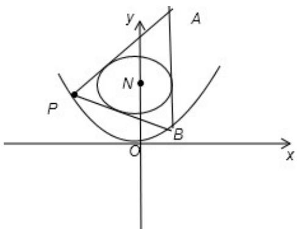

> [!faq]- 2011年浙江高考数学(理科)试卷(含答案)解析
>
> > [!success]- **【答案】** 详见解析
>
> > [!note]- **【分析】**
> > (I) 由题意抛物线 $C_1: x^2 = y$ , 可以知道其准线方程为 $y = -\frac{1}{4}$ , 有圆 $C_2: x^2 + (y - 4)^2 = 1$ 的方程可以知道圆心坐标为 $(0, 4)$ , 所求易得到所求的点到线的距离;
>
> > [!note]- **【解析】**
> > 解：（I）由题意画出简图为：
> >
> > 由于抛物线 $C_{1}$ : $x^{2}=y$ ,
> >
> > 利用抛物线的标准方程易知其准线方程为： $y=-\frac{1}{4}$
> >
> > 利用圆 $C_{2}$ : $x^{2} + (y - 4)^{2} = 1$ 的方程得起圆心 M (0, 4)，
> >
> > 利用点到直线的距离公式可以得到距离为 $\frac{17}{4}$
> >
> > (II) 设点 P $(x_{0}, x_{0}^{2})$ ，A $(x_{1}, x_{1}^{2})$ ，B $(x_{2}, x_{2}^{2})$ ；
> >
> > 由题意得： $x_{0}\neq0,\quad x_{2}\neq\pm1,\quad x_{1}\neq x_{2}$
> >
> > 设过点 P 的圆 $c_{2}$ 的切线方程为： $y - x_{0}^{2} = k(x - x_{0})$ 即 $y = kx - kx_{0} + x_{0}^{2}$ ①
> >
> > 则 $\frac{|kx_0 + 4 - x_0^2|}{\sqrt{1 + k^2}} = 1$ ，即 $(x_0^2 - 1) k^2 + 2x_0 (4 - x_0^2) k + (x_0^2 - 4)^2 - 1 = 0,$
> >
> > 设 PA，PB 的斜率为 $k_{1}$ ， $k_{2}$ （ $k_{1} \neq k_{2}$ ），则 $k_{1}$ ， $k_{2}$ 应该为上述方程的两个根，
> >
> > $$
> > \begin{array}{l} k _ {1} + k _ {2} = \frac {2 x _ {0} ^ {2} (x _ {0} ^ {2} - 4)}{x _ {0} ^ {2} - 1}, k _ {1} \bullet k _ {2} = \frac {(x _ {0} ^ {2} - 4) ^ {2} - 1}{x _ {0} ^ {2} - 1}; \end{array}
> > $$
> >
> > 代入①得： $x^{2}-kx+kx_{0}-x_{0}^{2}=0$ 则 $x_{1}$ ， $x_{2}$ 应为此方程的两个根，
> >
> > 故 $x_{1}=k_{1}-x_{0},\quad x_{2}=k_{2}-x_{0}$
> >
> > $$
> > \frac {2 x _ {0} (x _ {0} ^ {2} - 4)}{x _ {0} ^ {2} - 1} - 2 x _ {0}, k _ {M P} = \frac {x _ {0} ^ {2} - 4}{x _ {0}}
> > $$
> >
> > $\therefore k_{AB} = x_1 + x_2 = k_1 + k_2 - 2x_0 =$
> >
> > 由于 MP⊥AB，∴ $k_{AB} \bullet K_{MP} = -1 \Rightarrow x_{0}^{2} = \frac{23}{5}$
> >
> > 故P $(\pm \sqrt{\frac{23}{5}},\frac{23}{5})$ 直线 $l$ 的方程为： $y = \pm \frac{3\sqrt{115}}{115} x + 4.$
> >
> > 
> >
> > 点评: 此题重点考查了抛物线即圆的标准方程, 还考查了相应的曲线性质即设出直线方程, 利用根与系数的思想整体代换, 进而解出点的坐标, 理应直线与圆相切得到要求的直线方程.
