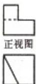
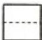
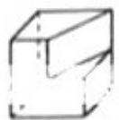

<!-- question-source:start -->
2、（2011·浙江）把复数 z 的共轭复数记作 $\overline{Z}$ ，i 为虚数单位。若 $z=1+i$ ，则 $(1+z)\cdot\overline{Z}=$ （）
A、3 - i B、3+i
C、1+3i D、3

  
侧视图

<!-- question-source:end -->

![[高中/真题/按年份分类/2011/2011年浙江高考数学_理科_试卷_含答案_/选择题/题目/answers/Q00023355A1.md]]
