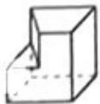
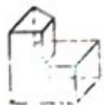
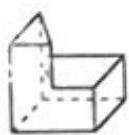

<!-- question-source:start -->
3、（2011·浙江）若某几何体的三视图如图所示，则这个几何体的直观图可以是（）
俯视图
A、
B、

C、

D、

<!-- question-source:end -->

![[高中/真题/按年份分类/2011/2011年浙江高考数学_理科_试卷_含答案_/选择题/题目/answers/Q00023356A1.md]]
