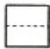
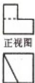

> [!faq]- 2011年浙江高考数学(理科)试卷(含答案)解析
>
> > [!success]- **【答案】** A
>
> > [!note]- **【分析】**
> > 求出 $\overline{Z}$ ，然后代入 $(1+z)\cdot\overline{Z}$ ，利用复数的运算法则展开化简为： $a+bi(a,b\in R)$ 的形式，即可得到答案.
>
> > [!note]- **【解析】**
> > 解：∵复数 z=1+i，i 为虚数单位， $\overline{Z}=1-i$ ，则 $(1+z)\cdot\overline{Z}=(2+i)(1-i)=3-i$
> >
> > 故选A.
> >
> > 点评：本题考查复数代数形式的混合运算，共轭复数，考查计算能力，是基础题，常考题型.
> >
> > 
> >
> >   
> > 侧视图
