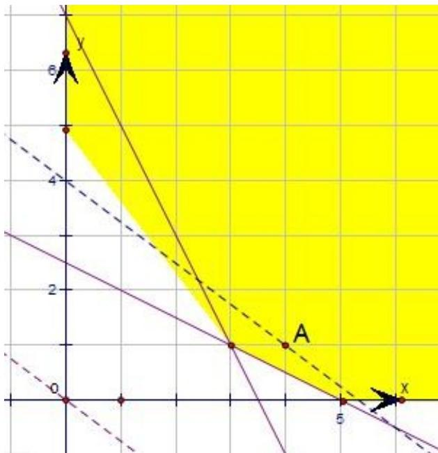

> [!faq]- 2011年浙江高考数学(理科)试卷(含答案)解析
>
> > [!success]- **【答案】** B
>
> > [!note]- **【分析】**
> > 本题考察的知识点是简单线性规划的应用，我们要先画出满足约束条件 $\left\{\begin{aligned}x+2y&-5>0\\ 2x+y&-7>0\\ x&\geq0,&y\geq0\end{aligned}\right.$ 的平面区域，然
>
> > [!note]- **【解析】**
> > 解：依题意作出可行性区域如图，目标函数 $z = 3x + 4y$ 在点（4，1）处取到最小值 $z = 16$
> >
> > 故选B.
> >
> > 
> >
> > 点评: 在解决线性规划的小题时, 常用 “角点法”, 其步骤为: ①由约束条件画出可行域 $\Rightarrow$ ②求出可行域各个角点的坐标 $\Rightarrow$ ③将坐标逐一代入目标函数 $\Rightarrow$ ④验证, 求出最优解.
