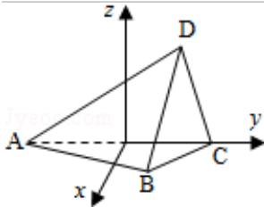

> [!faq]- 2011年重庆市高考数学试卷(文科)含答案解析
>
> > [!success]- **【答案】** ； （Ⅱ）过 F 作 FE⊥AB，垂足为 E，连接 DE，
>
> > [!note]- **【分析】**
> > 法一：几何法，
>
> > [!note]- **【解析】**
> > 分析】法一：几何法，
> >
> > （Ⅰ）过D作DF⊥AC，垂足为F，由平面ABC⊥平面ACD，由面面垂直的性质，可得DF是四面体ABCD的面ABC上的高；设G为边CD的中点，可得AG⊥CD，计算可得AG与DF的长，进而可得 $S_{\triangle ABC}$ ，由棱锥体积公式，计算可得
> > 答案；
> >
> > （Ⅱ）过 F 作 FE⊥AB，垂足为 E，连接 DE，
> > 分析可得 $\angle DEF$ 为二面角 C-AB-D 的平面角，计算可得 EF 的长，由（Ⅰ）中 DF 的值，结合正切的定义，可得
> > 答案.
> >
> > 法二：向量法，
> >
> > （Ⅰ）首先建立坐标系，根据题意，设 O 是 AC 的中点，过 O 作 OH⊥AC，交 AB 与 H，过 O 作 OM⊥AC，交 AD 与 M；易知 OH⊥OM，因此可以以 O 为原点，以射线 OH、OC、OM 为 x 轴、y 轴、z 轴，建立空间坐标系 O - XYZ，进而可得 B、D 的坐标；从而可得 △ ACD 边 AC 的高即棱住的高与底面的面积，计算可得
> > 答案；
> >
> > （Ⅱ）设非零向量 $\vec{\mathbf{n}} = (1, \mathbf{m}, \mathbf{n})$ 是平面ABD的法向量，由（I）易得向量 $\vec{\mathbf{n}}$ 的坐标，同时易得 $\vec{\mathbf{k}} = (0, 0, 1)$ 是平面ABC的法向量，由向量的夹角公式可得从而 $\cos < \vec{\mathbf{n}}, \vec{\mathbf{k}}>$ ，进而由同角三角函数的基本关系，可得 $\tan < \vec{\mathbf{n}}, \vec{\mathbf{k}}>$ ，即可得
> > 答案.
> >
> > 【
> > 解答】解：法一
> >
> > （Ⅰ）如图：过 D 作 DF⊥AC，垂足为 F，由平面 ABC⊥平面 ACD，
> >
> > 可得 DF⊥平面 ABC，即 DF 是四面体 ABCD 的面 ABC 上的高；
> >
> > 设 G 为边 CD 的中点，由 AC=AD，可得 AG⊥CD，
> >
> > $$
> > \mathrm{AG} = \sqrt {\mathrm{AC} ^ {2} - \mathrm{CG} ^ {2}} = \sqrt {4 - \frac {1}{4}} = \frac {\sqrt {1 5}}{2};
> > $$
> >
> > 由 $S_{\triangle ADC}=\frac{1}{2}AC\cdot DF=\frac{1}{2}CD\cdot AG$ 可得， $DF=\frac{AG\cdot CD}{AC}=\frac{\sqrt{15}}{4}$ ;
> >
> > 在 Rt△ABC 中， $AB=\sqrt{AC^{2}-BC^{2}}=\sqrt{3}$
> >
> > $$
> > S _ {\triangle A B C} = \sqrt {3} A B \cdot B C = \frac {\sqrt {3}}{2};
> > $$
> >
> > 故四面体的体积 $V=\frac{1}{3}\times S_{\triangle ABC}\times DF=\frac{\sqrt{5}}{8}$ ;
> >
> > （Ⅱ）如图，过 F 作 FE⊥AB，垂足为 E，连接 DE，
> >
> > 由（Ⅰ）知DF⊥平面ABC，由三垂线定理可得DE⊥AB，故∠DEF为二面角C-AB-D的平面角，
> >
> > 在 Rt△AFD 中， $AF=\sqrt{AD^{2}-DF^{2}}=\sqrt{4-\frac{15}{16}}=\frac{7}{4}$ ;
> >
> > 在 Rt△ABC 中，EF∥BC，从而 $\frac{EF}{BC}=\frac{AF}{AC}$ ，可得 $EF=\frac{7}{8}$ ;
> >
> > 在 Rt△DEF 中， $\tan\angle DEF=\frac{DF}{EF}=\frac{2\sqrt{15}}{7}$ .
> >
> > 则二面角 C - AB - D 的平面角的正切值为 $\frac{2\sqrt{15}}{7}$ .
> >
> > 解法二：（Ⅰ）如图（2）
> >
> > 设 O 是 AC 的中点，过 O 作 OH⊥AB，交 AB 与 H，过 O 作 OM⊥AC，交 AD 与 M；
> >
> > 由平面 ABC⊥平面 ACD，知 OH⊥OM，
> >
> > 因此以 O 为原点，以射线 OH、OC、OM 为 x 轴、y 轴、z 轴，建立空间坐标系 O - XYZ，已知 AC = 2，故 A、C 的坐标分别为 A（0，-1，0），C（0，1，0）；
> >
> > 设点 B 的坐标为 $(x_{1}, y_{1}, 0)$ ，由 $\overrightarrow{AB} \perp \overrightarrow{BC}, |\overrightarrow{BC}| = 1$ ;
> >
> > 有 $\left\{ \begin{array}{l} x_{1}^{2} + y_{1}^{2} = 1 \\ x_{1}^{2} + (y_{1} - 1)^{2} = 1 \end{array} \right.$
> >
> > 
> >
> > 解可得 $\left\{\begin{aligned}x_{1}&=\frac{\sqrt{3}}{2}\\ y_{1}&=\frac{1}{2}\end{aligned}\right.$ 或 $\left\{\begin{aligned}x_{1}&=-\frac{\sqrt{3}}{2}\\ y_{1}&=\frac{1}{2}\end{aligned}\right.$ （舍）；
> >
> > 即B的坐标为 $(\frac{\sqrt{3}}{2},\frac{1}{2},0)$ ，
> >
> > 又舍 D 的坐标为 $(0, y_{2}, z_{2})$ ，
> >
> > 由 $|\overrightarrow{CD}|=1,\quad|\overrightarrow{AD}|=2$ ，有 $(y_{2}-1)^{2}+z_{2}^{2}=1$ 且 $(y_{2}+1)^{2}+z_{2}^{2}=1;$
> >
> > 解可得 $\left\{\begin{aligned}y_{2}&=\frac{3}{4}\\ z_{2}&=\frac{\sqrt{15}}{4}\end{aligned}\right.$ 或 $\left\{\begin{aligned}y_{2}&=\frac{3}{4}\\ z_{2}&=-\frac{\sqrt{15}}{4}\end{aligned}\right.$ （舍），
> >
> > 则 D 的坐标为 $(0, \frac{3}{4}, \frac{\sqrt{15}}{4})$ ，
> >
> > 从而可得 $\triangle \mathrm{ACD}$ 边AC的高为 $\mathrm{h = |z_2| = \frac{\sqrt{15}}{4}}$
> >
> > 又 $|\overrightarrow{AB}| = \sqrt{3}$ ， $|\overrightarrow{BC}| = 1$
> >
> > 故四面体的体积 $V=\frac{1}{3}\times\frac{1}{2}\times|\overrightarrow{AB}|\times|\overrightarrow{BC}|h=\frac{\sqrt{5}}{8};$
> >
> > （Ⅱ）由（Ⅰ）知 $\overrightarrow{\mathrm{AB}} = (\frac{\sqrt{3}}{2}, \frac{3}{2}, 0)$ ， $\overrightarrow{\mathrm{AD}} = (0, \frac{7}{4}, \frac{\sqrt{15}}{4})$ ，
> >
> > 设非零向量 $\vec{\mathrm{n}} = (1, \mathrm{m}, \mathrm{n})$ 是平面ABD的法向量，则由 $\vec{\mathrm{n}} \perp \overrightarrow{\mathrm{AB}}$ 可得， $\frac{\sqrt{3}}{2} \mathrm{l} + \frac{3}{2} \mathrm{~m} = 0$ ，（1）；由 $\vec{\mathrm{n}} \perp \overrightarrow{\mathrm{AD}}$ 可得， $\frac{7}{4} \mathrm{~m} + \frac{\sqrt{15}}{4} \mathrm{n} = 0$ ，（2）；
> >
> > 取 $m = -1$ ，由（1）
