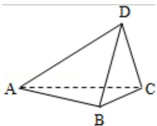

<!-- question-source:start -->
20. （12 分）（2011·重庆）如图，在四面体 ABCD 中，平面 ABC⊥平面 ACD，AB⊥BC，AC=AD=2，BC=CD=1

（Ⅰ）求四面体 ABCD 的体积；

（Ⅱ）求二面角 C - AB - D 的平面角的正切值.

<!-- question-source:end -->

![[高中/真题/按年份分类/2011/2011年重庆市高考数学试卷_文科_含答案/解答题/题目/answers/Q00022945A1.md]]
