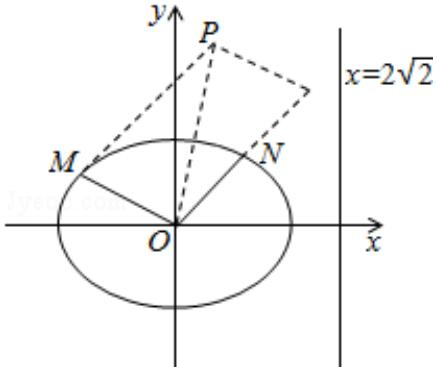

<!-- question-source:start -->
21.（12分）（2011·重庆）如图，椭圆的中心为原点0，离心率 $e=\frac{\sqrt{2}}{2}$ ，一条准线的方程是x=2 $\sqrt{2}$

（Ⅰ）求椭圆的标准方程；

（Ⅱ）设动点 P 满足： $\overrightarrow{OP}=\overrightarrow{OM}+2\overrightarrow{ON}$ ，其中 M、N 是椭圆上的点，直线 OM 与 ON 的斜率之积为 $-\frac{1}{2}$ ，问：是否存在定点 F，使得 $|PF|$ 与点 P 到直线 I: $x=2\sqrt{10}$ 的距离之比为定值；若存在，求 F 的坐标，若不存在，说明理由.

## 2011 年重庆市高考数学试卷（文科）

参考答案与试题解析

##
一、选择题（共10小题，每小题5分，满分50分）
<!-- question-source:end -->

![[高中/真题/按年份分类/2011/2011年重庆市高考数学试卷_文科_含答案/解答题/题目/answers/Q00030865A1.md]]
