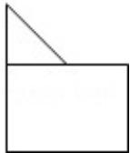
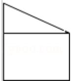
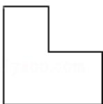

> [!faq]- 2011年高考浙江文科数学试题及答案(精校版)解析
>
> > [!success]- **【答案】** B
>
> > [!note]- **【分析】**
> > A、C选项中正视图不符合，D答案中侧视图不符合，由排除法即可选出答案.
>
> > [!note]- **【解析】**
> > 【分析】A、C选项中正视图不符合，D答案中侧视图不符合，由排除法即可选出答案.
> >
> > 【解答】解：A、C选项中正视图不符合，A的正视图为
> >
> > 
> >
> > 
> >
> > C 的正视图为
> >
> > 
> >
> > D 答案中侧视图不符合．D 答案中侧视图为
> >
> > 故选B
> >
> > 【点评】本题考查空间几何体的三视图，考查空间想象能力.
