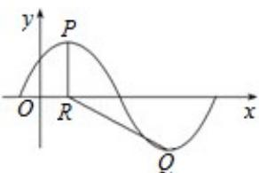

<!-- question-source:start -->
18. (14 分) (2011·浙江) 已知函数 $f(x) = \text{Asin} \left( \frac{\pi}{3} x + \phi \right)$ , $x \in \mathbb{R}, A > 0, 0 < \phi < \frac{\pi}{2}$ . $y = f(x)$ 的部分图象，如图所示，P、Q 分别为该图象的最高点和最低点，点 P 的坐标为 (1, A).

（Ⅰ）求 f（x）的最小正周期及 $\varphi$ 的值；

（Ⅱ）若点 R 的坐标为 $(1, 0)$ ， $\angle PRQ = \frac{2\pi}{3}$ ，求 A 的值.

【考点】函数 $y=Asin\left(\omega x+\varphi\right)$ 的图象变换；三角函数的周期性及其求法.

【专题】三角函数的图像与性质.
<!-- question-source:end -->

![[高中/真题/按年份分类/2011/2011年高考浙江文科数学试题及答案_精校版_/三_解答题_共5小题_满分72分_/题目/answers/Q00020713A1.md]]
