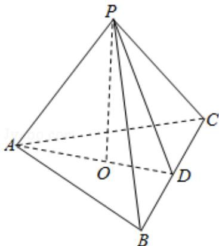

<!-- question-source:start -->
20.（14分）（2011·浙江）如图，在三棱锥P-ABC中，AB=AC，D为BC的中点，PO⊥平面ABC，垂足O落在线段AD上.

（Ⅰ）证明：AP⊥BC；

（Ⅱ）已知 BC=8，PO=4，AO=3，OD=2．求二面角 B-AP-C 的大小.

【考点】与二面角有关的立体几何综合题；空间中直线与直线之间的位置关系；二面角的平面角及求法.

【专题】空间位置关系与距离；空间角；立体几何.
<!-- question-source:end -->

![[高中/真题/按年份分类/2011/2011年高考浙江文科数学试题及答案_精校版_/三_解答题_共5小题_满分72分_/题目/answers/Q00020715A1.md]]
