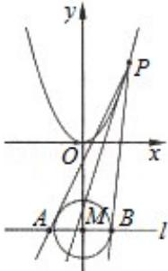

<!-- question-source:start -->
22. (15 分) (2011·浙江) 如图, 设 P 是抛物线 $C_1: x^2 = y$ 上的动点. 过点 P 做圆 $C_2: x^2 +$

$(y+3)^{2}=1$ 的两条切线，交直线 l: y=-3 于 A, B 两点.

（Ⅰ）求 $C_{2}$ 的圆心 M 到抛物线 $C_{1}$ 准线的距离.

（Ⅱ）是否存在点 P，使线段 AB 被抛物线 $C_{1}$ 在点 P 处的切线平分？若存在，求出点 P 的坐标；若不存在，请说明理由.

【考点】圆锥曲线的综合；抽象函数及其应用；直线与圆锥曲线的综合问题.

【专题】圆锥曲线的定义、性质与方程.
<!-- question-source:end -->

![[高中/真题/按年份分类/2011/2011年高考浙江文科数学试题及答案_精校版_/三_解答题_共5小题_满分72分_/题目/answers/Q00020717A1.md]]
