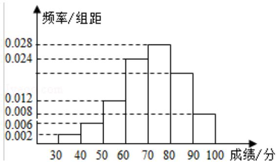

<!-- question-source:start -->
13. (4 分) (2011·浙江) 某小学为了解学生数学课程的学习情况, 在 3000 名学生中随机抽取 200 名, 并统计这 200 名学生的某次数学考试成绩, 得到了样本的频率分布直方图 (如图). 根据频率分布直方图 3000 名学生在该次数学考试中成绩小于 60 分的学生数是 600 .

【考点】频率分布直方图.

【专题】概率与统计.

【
<!-- question-source:end -->

![[高中/真题/按年份分类/2011/2011年高考浙江文科数学试题及答案_精校版_/填空题/题目/answers/Q00021676A1.md]]
