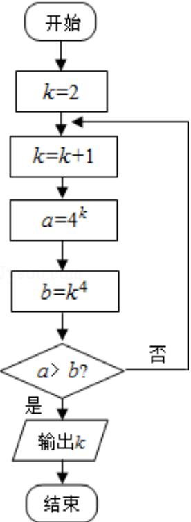

<!-- question-source:start -->
14. （4 分）（2011·浙江）某程序框图如图所示，则该程序运行后输出的 k 的值是 5 .

  
【考点】程序框图.

【专题】算法和程序框图.

【
<!-- question-source:end -->

![[高中/真题/按年份分类/2011/2011年高考浙江文科数学试题及答案_精校版_/填空题/题目/answers/Q00021677A1.md]]
