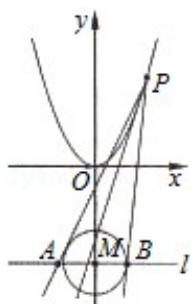

> [!faq]- 2011年高考浙江文科数学试题及答案(精校版)解析
>
> > [!success]- **【答案】** 详见解析
>
> > [!note]- **【分析】**
> > （Ⅰ）先求出抛物线 $C_{1}$ 准线的方程，再利用点到直线距离的求法求出 $C_{2}$ 的圆心 M 到抛物线 $C_{1}$ 准线的距离即可.
>
> > [!note]- **【解析】**
> > 解：（Ⅰ）因为抛物线 $C_{1}$ 准线的方程为： $y = -\frac{1}{4}$ ,
> >
> > 所以圆心 M 到抛物线 $C_{1}$ 准线的距离为： $\left|-\frac{1}{4}-(-3)\right|=\frac{11}{4}$ .
> >
> > （Ⅱ）设点 P 的坐标为 $\left(x_{0}, x_{0}^{2}\right)$ ，抛物线 $C_{1}$ 在点 P 处的切线交直线 l 与点 D，
> >
> > 因为： $y=x^{2}$ ，所以： $y'=2x$ ;
> >
> > 再设 A, B, D 的横坐标分别为 $x_{A}$ , $x_{B}$ , $x_{D}$ ,
> >
> > ∴过点 P $\left(x_{0}, x_{0}^{2}\right)$ 的抛物线 $C_{1}$ 的切线的斜率 $k=2x_{0}$
> >
> > 过点 $\mathrm{P}(\mathrm{x}_0, \mathrm{x}_0^2)$ 的抛物线 $C_1$ 的切线方程为： $\mathrm{y} - \mathrm{x}_0^2 = 2\mathrm{x}_0 (\mathrm{x} - \mathrm{x}_0)$ ①当 $x_0 = 1$ 时，过点 $P(1,1)$ 且与圆 $C_2$ 相切的切线PA方程为： $y - 1 = \frac{15}{8}(x - 1)$ . 可得 $x_A = -\frac{17}{15}$ ， $x_B = 1$ ， $x_D = -1$ ， $x_A + x_B \neq 2x_D$ .
> >
> > 当 $x_0 = -1$ 时，过点 $P(-1,1)$ 且与圆 $C_2$ 的相切的切线PB的方程为： $y - 1 = -\frac{15}{8}(x + 1)$ . 可得 $x_A = -1$ ， $x_B = \frac{17}{15}$ ， $x_D = 1$ ， $x_A + x_B \neq 2x_D$ .
> >
> > 所以 $x_0^2 - 1 \neq 0$ . 设切线PA，PB的斜率为 $k_1$ ， $k_2$ ，
> >
> > 则：PA: $y - x_0^2 = k_1(x - x_0)$ ②
> >
> > PB: $y - x_0^2 = k_2(x - x_0)$ . ③
> >
> > 将 $y = -3$ 分别代入①，②，③得 $x_D = \frac{x_0^2 - 3}{2x_0}(x_0 \neq 0)$ ; $x_A = x_0 - \frac{x_0^2 + 3}{k_1}$ ; $x_B = x_0 - \frac{x_0^2 + 3}{k_2}$ ( $k_1, k_2 \neq 0$ )
> >
> > 从而 $x_A + x_B = 2x_0 - (x_0^2 + 3) (\frac{1}{k_1} + \frac{1}{k_2})$ .
> >
> > 又 $\frac{|-\texttt{x}_0\texttt{k}_1 + \texttt{x}_0^2 + 3|}{\sqrt{\texttt{k}_1^2 + 1}} = 1$ ,
> >
> > 即 $(x_0^2 - 1) k_1^2 - 2 (x_0^2 + 3) x_0 k_1 + (x_0^2 + 3)^2 - 1 = 0$ ,
> >
> > 同理 $(x_0^2 - 1) k_2^2 - 2 (x_0^2 + 3) x_0 k_2 + (x_0^2 + 3)^2 - 1 = 0$ ,
> >
> > 所以 $k_1, k_2$ 是方程 $(x_0^2 - 1) k^2 - 2 (x_0^2 + 3) x_0 k + (x_0^2 + 3)^2 - 1 = 0$ 的两个不等的根，
> >
> > 从而 $k_1 + k_2 = \frac{2(3 + x_0)^2 x_0}{x_0^2 - 1}, k_1 \cdot k_2 = \frac{(3 + x_0^2)^2 - 1}{x_0^2 - 1}$ ,
> >
> > 因为 $x_A + x_B = 2X_D$ .
> >
> > 所以 $2x_0 - (3 + x_0^2) (\frac{1}{k_1} + \frac{1}{k_2}) = \frac{x_0^2 - 3}{x_0}$ , 即 $\frac{1}{k_1} + \frac{1}{k_2} = \frac{1}{x_0}$ .
> >
> > 从而 $\frac{2(3 + x_0^2) x_0}{(x_0^2 + 3)^2 - 1} = \frac{1}{x_0}$ ,
> >
> > 进而得 $x_0^4 = 8, x_0 = \pm \sqrt[4]{8}$ .
> >
> > 综上所述，存在点P满足题意，点P的坐标为 $(+4\sqrt{-5}, 2\sqrt{-5})$ .
> >
> > 综上所述，存在点P满足题意，点P的坐标为 $(\pm \sqrt[4]{8}, 2\sqrt{2})$ 。
> >
> > 
> >
> > 【点评】本题是对椭圆与抛物线，以及直线与椭圆和抛物线位置关系的综合考查。在圆锥曲线的三种常见曲线中，抛物线是最容易的，而双曲线是最复杂的，所以一般出大题时，要么是单独的椭圆与直线，要么是椭圆与抛物线，直线相结合。这一类型题目，是大题中比较有难度的题。
