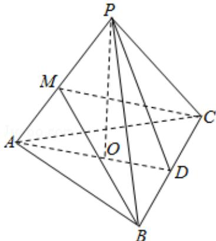

> [!faq]- 2011年高考浙江文科数学试题及答案(精校版)解析
>
> > [!success]- **【答案】** 详见解析
>
> > [!note]- **【分析】**
> > （I）由题意．因为 PO⊥平面 ABC，垂足 O 落在线段 AD 上所以 BC⊥PO．有 AB=AC，D 为 BC 的中点，得到 BC⊥AD，进而得到线面垂直，即可得到所证；
>
> > [!note]- **【解析】**
> > 解：（I）由题意画出图如下：
> >
> > 由 AB=AC，D 为 BC 的中点，得 AD⊥BC，
> >
> > 又 PO⊥平面 ABC，垂足 O 落在线段 AD 上，得到 PO⊥BC，
> >
> > ∵PO∩AD=O∴BC⊥平面 PAD，故 BC⊥PA.
> >
> > (II) 如图，在平面 PAB 中作 BM⊥PA 于 M，连接 CM，
> >
> > $\because \mathrm{BC} \perp \mathrm{PA}, \therefore \mathrm{PA} \perp$ 平面BMC， $\therefore \mathrm{AP} \perp \mathrm{CM}$ ，故 $\angle \mathrm{BMC}$ 为二面角B-AP-C的平面角，
> >
> > 在直角三角形ADB中， $AB^2 = AD^2 +BD^2 = 41$ 得： $AB = \sqrt{41}$
> >
> > 在直角三角形 POD 中， $PD^{2}=PO^{2}+OD^{2}$ ，在直角三角形 PDB 中，
> >
> > $PB^{2}=PD^{2}+BD^{2},\therefore PB^{2}=PO^{2}+OD^{2}+BD^{2}=36,$ 得 PB=6,
> >
> > 在直角三角形 POA 中， $PA^{2}=AO^{2}+OP^{2}=25$ ，得 PA=5，
> >
> > 又 $\cos \angle BPA = \frac{PA^2 + PB^2 - AB^2}{2PA \cdot PB} = \frac{1}{3}$ ，从而 $\sin \angle BPA = \frac{2\sqrt{2}}{3}$ .
> >
> > 故 $\mathrm{BM} = \mathrm{PB}\sin \angle \mathrm{BPA} = 4\sqrt{2}$ 同理： $\mathrm{CM} = 4\sqrt{2},$
> >
> > $\because BM^{2}+MC^{2}=BC^{2},\therefore$ 二面角 B-AP-C 的大小为 $90^{\circ}$ .
> >
> > 
> >
> > 【点评】（I）此问考查了线面垂直的判定定理，还考查了线面垂直的性质定理；
> >
> > (II) 此问考查了面面垂直的判定定理，二面角的平面角的定义，还考查了在三角形中求解.
