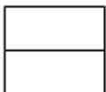
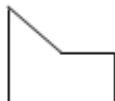
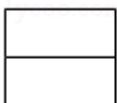
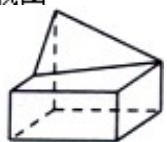
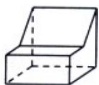
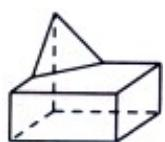
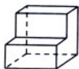

<!-- question-source:start -->
7. （5 分）（2011·浙江）几何体的三视图如图所示，则这个几何体的直观图可以是（）

  
侧视图

正视图

俯视图

A.

B.

C.

D.

【考点】空间几何体的直观图；简单空间图形的三视图.

【专题】立体几何.
<!-- question-source:end -->

![[高中/真题/按年份分类/2011/2011年高考浙江文科数学试题及答案_精校版_/选择题/题目/answers/Q00020702A1.md]]
