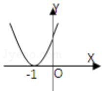
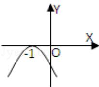
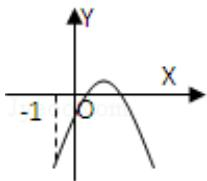
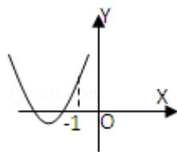

<!-- question-source:start -->
10.（5分）(2011·浙江)设函数 $f(x) = ax^2 + bx + c(a, b, c \in R)$ ，若 $x = -1$ 为函数 $y = f(x)e^x$ 的一个极值点，则下列图象不可能为 $y = f(x)$ 的图象是（）

A.

B.

C.

D.

【考点】利用导数研究函数的单调性；函数的图象与图象变化.

【专题】函数的性质及应用；导数的概念及应用.

【
<!-- question-source:end -->

![[高中/真题/按年份分类/2011/2011年高考浙江文科数学试题及答案_精校版_/选择题/题目/answers/Q00021673A1.md]]
