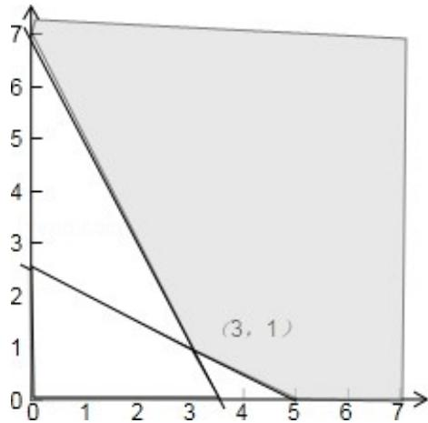

> [!faq]- 2011年高考浙江文科数学试题及答案(精校版)解析
>
> > [!success]- **【答案】** A
>
> > [!note]- **【分析】**
> > 我画出满足不等式组 $\left\{\begin{aligned}x+2y-5&\geqslant0\\ 2x+y-7&\geqslant0\\ x&\geqslant0,y&\geqslant0\end{aligned}\right.$ 的平面区域，求出平面区域中各角点的坐标，然后利用角点法，将各个点的坐标逐一代入目标函数，比较后即可得到 $3x+4y$ 的最小值.
>
> > [!note]- **【解析】**
> > 分析】我画出满足不等式组 $\left\{\begin{aligned}x+2y-5&\geqslant0\\ 2x+y-7&\geqslant0\\ x&\geqslant0,y&\geqslant0\end{aligned}\right.$ 的平面区域，求出平面区域中各角点的坐标，然后利用角点法，将各个点的坐标逐一代入目标函数，比较后即可得到 $3x+4y$ 的最小值.
> >
> > 【
> > 解答】解：满足约束条件 $\left\{\begin{aligned}x+2y-5&\geqslant0\\ 2x+y-7&\geqslant0\\ x&\geqslant0,y&\geqslant0\end{aligned}\right.$ 的平面区域如下图所示：
> >
> > 由图可知，当 $x = 3$ ， $\mathrm{y} = 1$ 时 $3\mathrm{x} + 4\mathrm{y}$ 取最小值13故选A
> >
> > 
> >
> > 【点评】用图解法解决线性规划问题时，
> > 分析题目的已知条件，找出约束条件和目标函数是关键，可先将题目中的量分类、列出表格，理清头绪，然后列出不等式组（方程组）寻求约束条件，并就题目所述找出目标函数．然后将可行域各角点的值一一代入，最后比较，即可得到目标函数的最优解.
