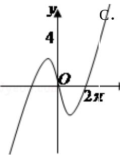
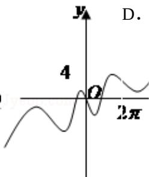
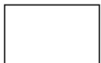
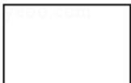

# 2011年山东省高考数学试卷（理科）

##
一、选择题（共12小题，每小题3分，满分36分）

1. （3分）（2011·山东）设集合 $M=\{x|x^{2}+x-6<0\}$ ， $N=\{x|1\leq x\leq3\}$ ，则 $M\cap N=$ （）
A. [1, 2) B. [1, 2] C. (2, 3] D. [2, 3]

2. (3分) (2011·山东) 复数 $z = \frac{2 - i}{1 + i}$ (i是虚数单位) 在复平面内对应的点位于象限为( )

A. 第一象限    B. 第二象限    C. 第三象限    D. 第四象限

3. (3 分) (2011·山东) 若点 (a, 9) 在函数 $y = 3^x$ 的图象上，则 $\tan \frac{a\pi}{6}$ 的值为 ( )

A. 0

B. $\frac{\sqrt{3}}{3}$ C. 1

D. $\sqrt{3}$

4. （3分）（2011·山东）不等式 $|x-5|+|x+3|\geq10$ 的解集是（）
A. $[-5, 7]$ B. $[-4, 6]$ C. $(-∞, -∞)$ D. $(-∞, -∞)$ $[5]∪[7, +∞)$ $[4]∪[6, +∞)$

5. (3 分) (2011·山东) 对于函数 $y = f(x), x \in R$ ，“ $y = |f(x)|$ 的图象关于 $y$ 轴对称”是 “ $y = f(x)$ 是奇函数”的（）
A. 充分而不必要 B. 必要而不充分
条件 条件
C. 充要条件 D. 既不充分也不
必要条件

6.（3分）（2011·山东）若函数 $f(x) = \sin \omega x (\omega > 0)$ 在区间 $[0, \frac{\pi}{3}]$ 上单调递增，在区间 $[\frac{\pi}{3}, \frac{\pi}{2}]$ 上单调递减，则 $\omega =$ （ ）
A. 8 B. 2 C. $\frac{3}{2}$ D. $\frac{2}{3}$

7. （3分）（2011·山东）某产品的广告费用x与销售额y的统计数据如下表

<table><tr><td>广告费用 x(万元)</td><td>4</td><td>2</td><td>3</td><td>5</td></tr><tr><td>销售额 y(万元)</td><td>49</td><td>26</td><td>39</td><td>54</td></tr></table>

根据上表可得回归方程 $\widehat{\mathbf{y}} = \widehat{\mathbf{b}}\mathbf{x} + \widehat{\mathbf{a}}$ 的 $\widehat{\mathbf{b}}$ 为9.4，据此模型预报广告费用为6万元时销售额为（）

A. 63.6万元 B. 65.5万元 C. 67.7万元 D. 72.0万元

8. (3分) (2011·山东) 已知双曲线 $\frac{x^2}{a^2} - \frac{y^2}{b^2} = 1$ ( $a > 0, b > 0$ ) 的两条渐近线均和圆 $C: x^2 + y^2 - 6x + 5 = 0$ 相切，且双曲线的右焦点为圆 $C$ 的圆心，则该双曲线的方程为（）A. $\frac{x^2}{5} - \frac{y^2}{4} = 1$ B. $\frac{x^2}{4^2} - \frac{y^2}{5^2} = 1$ C. $\frac{x^2}{3^2} - \frac{y^2}{6^2} = 1$ D. $\frac{x^2}{6^2} - \frac{y^2}{3^2} = 1$

9. (3分) (2011·山东) 函数 $y = \frac{x}{2} - 2\sin x$ 的图象大致是（）

A.

10. （3分）（2011·山东）已知 f(x) 是 R 上最小正周期为 2 的周期函数，且当 $0 \leq x < 2$ 时，f(x) = x³ - x，则函数 y = f(x) 的图象在区间 [0, 6] 上与 x 轴的交点的个数为（）
A. 6 B. 7 C. 8 D. 9

11. （3 分）（2011·山东）如图是长和宽分别相等的两个矩形．给定下列三个命题：

① 存在三棱柱，其正（主）视图、俯视图如图；

② 存在四棱柱，其正（主）视图、俯视图如图；

③ 存在圆柱，其正（主）视图、俯视图如图.

其中真命题的个数是（）

正（主）视图

俯视图A.3 B.2 C.1 D.0

12. （3分）（2011·山东）设 $A_{1}$ ， $A_{2}$ ， $A_{3}$ ， $A_{4}$ 是平面直角坐标系中两两不同的四点，若 $\overrightarrow{A_{1}A_{3}} = \lambda \overrightarrow{A_{1}A_{2}} (\lambda \in \mathbb{R})$ ， $\overrightarrow{A_{1}A_{4}} = \mu \overrightarrow{A_{1}A_{2}} (\mu \in \mathbb{R})$ ，且 $\frac{1}{\lambda} + \frac{1}{\mu} = 2$ ，则称 $A_{3}$ ， $A_{4}$ 调和分割 $A_{1}, A_{2}$ ，已知点 C(c,0)，D(d,O)(c,d∈R) 调和分割点 A(0,0)，B(1,0)，则下面说法正确的是（）
A. C 可能是线段
AB 的中点
B. D 可能是线段
AB 的中点
C. C, D 可能同时
在线段 AB 上
D. C, D 不可能同
时在线段 AB 的
延长线上

##

![[高中/真题/按年份分类/2011/2011年高考真题数学_理__山东卷__含解析版_/填空题/填空题.md]]
![[高中/真题/按年份分类/2011/2011年高考真题数学_理__山东卷__含解析版_/选择题/选择题.md]]
![[高中/真题/按年份分类/2011/2011年高考真题数学_理__山东卷__含解析版_/解答题/解答题.md]]
