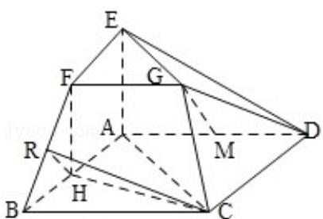

<!-- question-source:start -->
19. （12 分）（2011·山东）在如图所示的几何体中，四边形 ABCD 为平行四边形， $\angle ACB=90^{\circ}$ ，EA⊥平面 ABCD，EF∥AB，FG∥BC，EG∥AC．AB=2EF.

（Ⅰ）若 M 是线段 AD 的中点，求证：GM∥平面 ABFE；

（Ⅱ）若 AC=BC=2AE，求二面角 A-BF-C 的大小.

<!-- question-source:end -->

![[高中/真题/按年份分类/2011/2011年高考真题数学_理__山东卷__含解析版_/填空题/题目/answers/Q00023093A1.md]]
