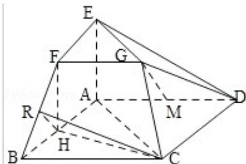

> [!faq]- 2011年高考真题数学【理】(山东卷)（含解析版）解析
>
> > [!success]- **【答案】** 详见解析
>
> > [!note]- **【分析】**
> > （Ⅰ）根据所给的一系列平行，得到三角形相似，根据平行四边形的判定和性
>
> > [!note]- **【解析】**
> > 分析：（Ⅰ）根据所给的一系列平行，得到三角形相似，根据平行四边形的判定和性
> >
> > 质，得到线与线平行，根据线与面平行的判定定理，得到线面平行.
> >
> > （II）根据二面角的求解的过程，先做出，再证明，最后求出来，这样三个环节，先证 $\angle HRC$ 为二面角的平面角，再设出线段的长度，在直角三角形中求出角的正切值，得到二面角的大小.
> >
> > 证明：（Ⅰ）∵EF∥AB，FG∥BC，EG∥AC，∠ACB=90°，
> > ∴∠EGF=90°，△ABC～△EFG，
> > 由于 AB=2EF，
> > ∴BC=2FG，
> > 连接 AF，
> > ∵FG∥BC， $FG=\frac{1}{2}BC$ 在□ABCD中，M是线段AD的中点，
> > ∴AM∥BC，且 $AM=\frac{1}{2}BC$ ,
> > ∴FG∥AM且FG=AM，
> > ∴四边形AFGM为平行四边形，
> > ∴GM∥FA，
> > ∵FAC平面ABFE，GM∉平面ABFE，
> > ∴GM∥平面ABFE.
> >
> > （Ⅱ）由题意知，平面 ABFE⊥平面 ABCD，
> >
> > 取 AB 的中点 H，连接 CH，
> >
> > $$
> > \because \mathrm{AC} = \mathrm{BC},
> > $$
> >
> > 则 $\mathrm{CH} \perp$ 平面ABFE，
> >
> > 过 H 向 BF 引垂线交 BF 于 R，连接 CR，
> >
> > 由线面垂直的性质可得 CR⊥BF，
> >
> > $\therefore \angle HRC$ 为二面角的平面角，
> >
> > 由题意，不妨设 AC=BC=2AE=2，
> >
> > 在直角梯形 ABFE 中，连接 FH，
> >
> > 则 FH⊥AB，
> >
> > 又 $\mathrm{AB} = 2\sqrt{2}$
> >
> > $\therefore \mathrm{HF} = \mathrm{AE} = 1$ ， $\mathrm{HR} = \frac{\mathrm{S}_{\triangle \mathrm{BHF}}}{\frac{1}{2}\times\mathrm{BE}} = \frac{\sqrt{2}}{\sqrt{3}} = \frac{\sqrt{6}}{3}$ ，由于 $\mathrm{CH} = \frac{1}{2}\mathrm{AB} = \sqrt{2},$
> >
> > ∴在直角三角形 CHR 中， $\tan\angle HRC=\frac{\sqrt{2}}{\sqrt{6}}=\sqrt{3}$
> >
> > 因此二面角 A - BF - C 的大小为 $60^{\circ}$
> >
> > 
> >
> > 点评：本题考查线面平行的判定定理，考查二面角的求法，考查求解二面角时的三个环节，本题是一个综合题目，题目的运算量不大.
