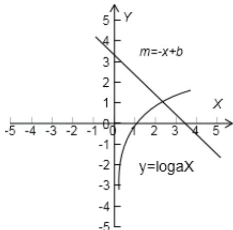

> [!faq]- 2011年高考真题数学【理】(山东卷)（含解析版）解析
>
> > [!success]- **【答案】** 为：2  点评：本题考查函数零点的判定定理，是一个基本初等函数的图象的应用，这种问题一般应用数形结合思想来解决。 ## 三、解答题（共6小题，满分74分）
>
> > [!note]- **【分析】**
> > 把要求零点的函数，变成两个基本初等函数，根据所给的a，b的值，可以判断两个函数的交点的所在的位置，同所给的区间进行比较，得到n的值.
>
> > [!note]- **【解析】**
> > 分析：把要求零点的函数，变成两个基本初等函数，根据所给的a，b的值，可以判断两个函数的交点的所在的位置，同所给的区间进行比较，得到n的值.
> >
> > 解答： 解：设函数 $y = \log_a x$ ， $m = -x + b$
> >
> > 根据 2<a<3<b<4,
> >
> > 对于函数 $y=\log_{a}x$ 在 x=2 时，一定得到一个值小于 1，
> >
> > 在同一坐标系中划出两个函数的图象，判断两个函数的图形的交点在（2，3）之间，
> >
> > ∴函数 f (x) 的零点 $x_{0} \in (n, n+1)$ 时，n=2，
> >
> > 故
> > 答案为：2
> >
> > 
> >
> > 点评：本题考查函数零点的判定定理，是一个基本初等函数的图象的应用，这种问题一般应用数形结合思想来解决。
> >
> > ## 三、解答题（共6小题，满分74分）
