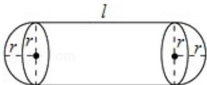

<!-- question-source:start -->
21. (12 分) (2011·山东) 某企业拟建造如图所示的容器 (不计厚度, 长度单位: 米), 其中容器的中间为圆柱形, 左右两端均为半球形, 按照设计要求容器的体积为 $\frac{80\pi}{3}$ 立方米, 且 $1 \geq 2r$ . 假设该容器的建造费用仅与其表面积有关. 已知圆柱形部分每平方米建造费用为 3 千元, 半球形部分每平方米建造费用为 $c$ ( $c > 3$ ) 千元. 设该容器的建造费用为 $y$ 千元.

（Ⅰ）写出 y 关于 r 的函数表达式，并求该函数的定义域；

（Ⅱ）求该容器的建造费用最小时的 r.

<!-- question-source:end -->

![[高中/真题/按年份分类/2011/2011年高考真题数学_理__山东卷__含解析版_/解答题/题目/answers/Q00023095A1.md]]
