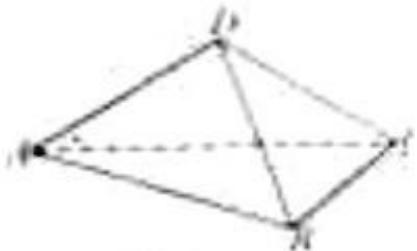

<!-- question-source:start -->
19. （2011·重庆）如图，在四面体ABCD中，平面ABC⊥ACD，AB⊥BC，AD=CD，∠CAD=30°

（Ⅰ）若 AD=2，AB=2BC，求四面体 ABCD 的体积.

（Ⅱ）若二面角 C-AB-D 为 $60^{\circ}$ ，求异面直线 AD 与 BC 所成角的余弦值.

<!-- question-source:end -->

![[高中/真题/按年份分类/2011/2011年高考重庆理科数学试题及答案_精校版_/解答题/题目/answers/Q00022860A1.md]]
