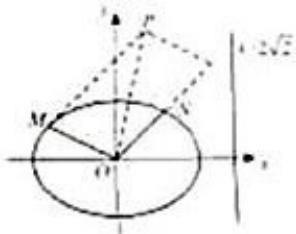

<!-- question-source:start -->
20. (2011·重庆) 如图, 椭圆的中心为原点 O, 离心率 $\mathrm{e} = \frac{\sqrt{2}}{2}$ , 一条准线的方程为 $\mathrm{x} = 2\sqrt{2}$ .

（Ⅰ）求该椭圆的标准方程.

（II）设动点P满足 $\overrightarrow{\mathrm{OP}} = \overrightarrow{\mathrm{OM}} +2\overrightarrow{\mathrm{ON}}$ ，其中M，N是椭圆上的点．直线OM与ON的斜率之积为 $-\frac{1}{2}$

问：是否存在两个定点 $\mathrm{F}_1$ ， $\mathrm{F}_2$ ，使得 $|\mathrm{PF}_1| + |\mathrm{PF}_2|$ 为定值．若存在，求 $\mathrm{F}_1$ ， $\mathrm{F}_2$ 的坐标；若不存在，说明理由.

<!-- question-source:end -->

![[高中/真题/按年份分类/2011/2011年高考重庆理科数学试题及答案_精校版_/解答题/题目/answers/Q00022861A1.md]]
