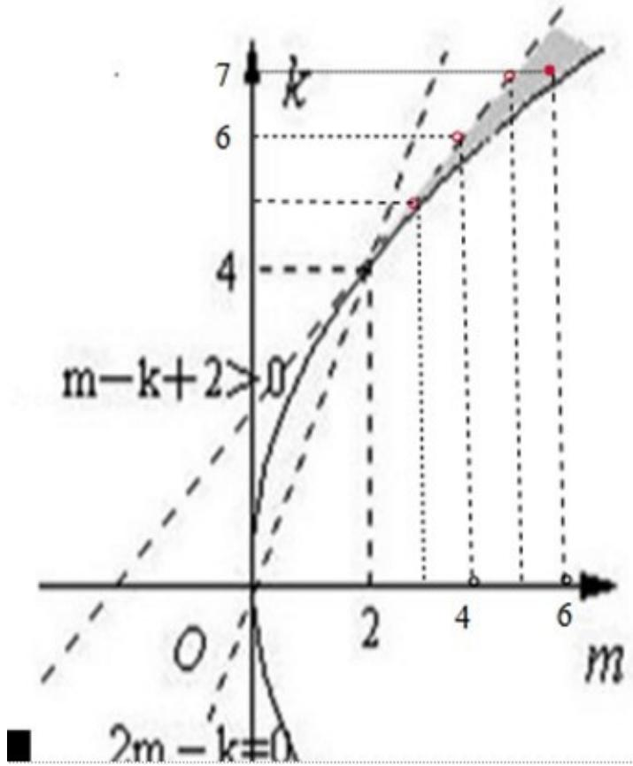

> [!faq]- 2011年高考重庆理科数学试题及答案(精校版)解析
>
> > [!success]- **【答案】** D
>
> > [!note]- **【分析】**
> > 将一元二次方程的根的分布转化为确定相应的二次函数的图象来处理，根据图象可得到关于 $\mathrm{m}$ 和 $\mathrm{k}$ 的不等式组，此时不妨考虑利用不等式所表示的平面区域来解决，但须注意这不是线性规划问题，同时注意取整点.
>
> > [!note]- **【解析】**
> > 分析：将一元二次方程的根的分布转化为确定相应的二次函数的图象来处理，根据图象可得到关于 $\mathrm{m}$ 和 $\mathrm{k}$ 的不等式组，此时不妨考虑利用不等式所表示的平面区域来解决，但须注意这不是线性规划问题，同时注意取整点.
> >
> > 解答: 解: 设 $f(x)=mx^{2}-kx+2$ ，由 $f(0)=2$ ，易知 $f(x)$ 的图象恒过定点 $(0,2)$ ，因此要使已知方程在区间 $(0,1)$ 内两个不同的根，即 $f(x)$ 的图象在区间 $(0,1)$ 内有两个不同的交点
> >
> > 即由题意可以得到：必有 $\left\{\begin{aligned}m&>0\\ f(1)&=m-k+2>0\\ 0&<\frac{k}{2m}<1\\ \Delta&=k^{2}-8m>0\end{aligned}\right.$ ，即 $\left\{\begin{aligned}m&>0,k>0\\ m-k+2&>0\\ 2m-k&>0\\ k^{2}-8m&>0\end{aligned}\right.$
> >
> > 在直角坐标系 mok 中作出满足不等式平面区域，
> >
> > 如图所示，设 $z = m + k$ ，则直线 $m + k - z = 0$ 经过图中的阴影中的整点（6，7）时，
> >
> > 
> >
> > $z=m+k$ 取得最小值，即 $z_{\min}=13$ .
> >
> > 故选D.
> >
> > 点评: 此题考查了二次函数与二次方程之间的联系,
> >
> > 解答要注意几个关键点: (1) 将一元二次方程根的分布转化一元二次函数的图象与 x 轴的交点来处理; (2) 将根据不等式组求两个变量的最值问题处理为规划问题; (3) 作出不等式表示的平面区域时注意各个不等式表示的公共区域; (4) 不可忽视求得最优解是整点.
> >
> > ## 二、填空题（共5小题，每小题3分，满分15分）
