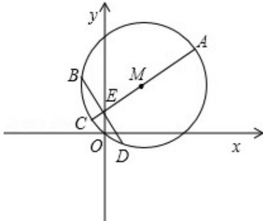

> [!faq]- 2011年高考重庆理科数学试题及答案(精校版)解析
>
> > [!success]- **【答案】** B
>
> > [!note]- **【分析】**
> > 把圆的方程化为标准方程后，找出圆心坐标与圆的半径，根据图形可知，过点E最长的弦为直径AC，最短的弦为过E与直径AC垂直的弦BD，根据两点间的距离公式求出ME的长度，根据垂径定理得到E为BD的中点，在直角三角形BME中，根据勾股定理求出BE，则 $\mathrm{BD} = 2\mathrm{BE}$ ，然后利用AC与BD的乘积的一半即可求出四边形ABCD的面积.
>
> > [!note]- **【解析】**
> > 分析：把圆的方程化为标准方程后，找出圆心坐标与圆的半径，根据图形可知，过点E最长的弦为直径AC，最短的弦为过E与直径AC垂直的弦BD，根据两点间的距离公式求出ME的长度，根据垂径定理得到E为BD的中点，在直角三角形BME中，根据勾股定理求出BE，则 $\mathrm{BD} = 2\mathrm{BE}$ ，然后利用AC与BD的乘积的一半即可求出四边形ABCD的面积.
> >
> > 解答：解：把圆的方程化为标准方程得： $(x-1)^{2}+(y-3)^{2}=10$
> >
> > 则圆心坐标为（1，3），半径为 $\sqrt{10}$ ，
> >
> > 根据题意画出图象，如图所示：
> >
> > 
> >
> > 由图象可知：过点 E 最长的弦为直径 AC，最短的弦为过 E 与直径 AC 垂直的弦，则 $AC=2\sqrt{10}$ ，MB= $\sqrt{10}$ ，ME= $\sqrt{(1-0)^{2}+(3-1)^{2}}=\sqrt{5}$ ，
> > 所以 BD=2BE=2 $\sqrt{(\sqrt{10})^{2}-(\sqrt{5})^{2}}=2\sqrt{5}$ ，又 AC⊥BD，
> > 所以四边形 ABCD 的面积 $S=\frac{1}{2}AC\cdot BD=\frac{1}{2}\times2\sqrt{10}\times2\sqrt{5}=10\sqrt{2}$ .
> >
> > 故选B
> >
> > 点评: 此题考查学生掌握垂径定理及勾股定理的应用, 灵活运用两点间的距离公式化简求值, 是一道中档题. 学生做题时注意对角线垂直的四边形的面积等于对角线乘积的一半.
