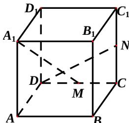

<!-- question-source:start -->
15、椭圆 $\frac{x^2}{4} + \frac{y^2}{3} = 1$ 的左焦点为 $F$ ，直线 $x = m$ 与椭圆相交于点 $A$ 、 $B$ ，当 $\Delta FAB$ 的周长最大时， $\Delta FAB$ 的面积是 \_\_\_\_。

<!-- question-source:end -->

![[高中/真题/按年份分类/2012/2012四川高考数学_理科_试题及参考答案/填空题/题目/answers/Q00026622A1.md]]
