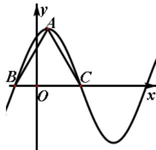

<!-- question-source:start -->
18、(本小题满分 12 分)

函数 $f(x)=6\cos^{2}\frac{\omega x}{2}+\sqrt{3}\cos\omega x-3(\omega>0)$ 在一个周期内的图象如图所示，A 为图象的最高.

点， $B$ 、 $C$ 为图象与 $\pmb{x}$ 轴的交点，且 $\Delta ABC$ 为正三角形。

（Ⅰ）求 $\omega$ 的值及函数 $f(x)$ 的值域；

（Ⅱ）若 $f(x_0) = \frac{8\sqrt{3}}{5}$ ，且 $x_0 \in (-\frac{10}{3}, \frac{2}{3})$ ，求 $f(x_0 + 1)$ 的值。

<!-- question-source:end -->

![[高中/真题/按年份分类/2012/2012四川高考数学_理科_试题及参考答案/填空题/题目/answers/Q00026625A1.md]]
