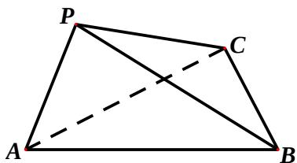

<!-- question-source:start -->
19、(本小题满分 12 分)

如图，在三棱锥 P-ABC 中， $\angle APB=90^{\circ}$ ， $\angle PAB=60^{\circ}$ ，AB=BC=CA，平面 $PAB\perp$ 平面 ABC。

（Ⅰ）求直线 $PC$ 与平面 $ABC$ 所成角的大小；

（Ⅱ）求二面角 B - AP - C 的大小。
<!-- question-source:end -->

![[高中/真题/按年份分类/2012/2012四川高考数学_理科_试题及参考答案/填空题/题目/answers/Q00026626A1.md]]
