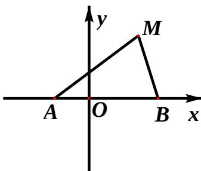

<!-- question-source:start -->
21、(本小题满分 12 分)

如图，动点 M 到两定点 $A(-1,0)$ 、 $B(2,0)$ 构成 $\Delta MAB$ ，且 $\angle MBA = 2\angle MAB$ ，设动点 M 的轨迹

（Ⅰ）求轨迹 C 的方程；

（Ⅱ）设直线 $y = -2x + m$ 与 y 轴交于点 P，与轨迹 C 相交于点 Q、R，
且 $\left|PQ\right|<\left|PR\right|$ ，求 $\frac{\left|PR\right|}{\left|PQ\right|}$ 的取值范围。

## 22、(本小题满分14分)

已知 $a$ 为正实数， $n$ 为自然数，抛物线 $y = -x^2 + \frac{a^n}{2}$ 与 $x$ 轴正半轴相交于点 $A$ ，设 $f(n)$ 为该抛物线在点 $A$ 处的切线在 $y$ 轴上的截距。

（Ⅰ）用 a 和 n 表示 $f(n)$ ;

（Ⅱ）求对所有 n 都有 $\frac{f(n)-1}{f(n)+1} \geq \frac{n^{3}}{n^{3}+1}$ 成立的 a 的最小值；

（III）当 $0 < a < 1$ 时，比较 $\sum_{k=1}^{n} \frac{1}{f(k) - f(2k)}$ 与 $\frac{27}{4} \mathbb{I} \frac{f(1) - f(n)}{f(0) - f(1)}$ 的大小，并说明理由。

## 参考
<!-- question-source:end -->

![[高中/真题/按年份分类/2012/2012四川高考数学_理科_试题及参考答案/解答题/题目/answers/Q00026628A1.md]]
