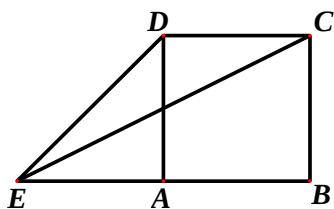
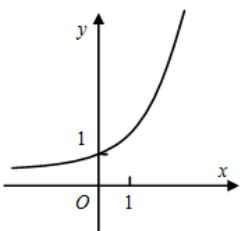
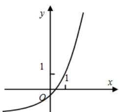
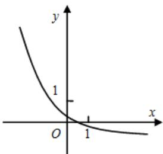
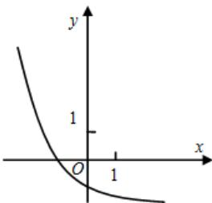

<!-- question-source:start -->
5、函数 $y = a^{x} - \frac{1}{a} (a > 0, a \neq 1)$ 的图象可能是（）

A

B

C

D

<!-- question-source:end -->

![[高中/真题/按年份分类/2012/2012四川高考数学_理科_试题及参考答案/选择题/题目/answers/Q00026612A1.md]]
