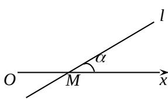

<!-- question-source:start -->
13. 已知函数 $y = f(x)$ 的图像是折线段 $ABC$ ，若中 $A(0,0)$ ， $B(\frac{1}{2},1)$ ， $C(1,0)$ .

函数 $y = xf(x) (0 \leq x \leq 1)$ 的图像与 x 轴围成的图形的面积为 \_\_\_\_.
<!-- question-source:end -->

![[高中/真题/按年份分类/2012/2012年上海高考数学真题_文科_试卷_word解析版_/填空题/题目/answers/Q00023819A1.md]]
