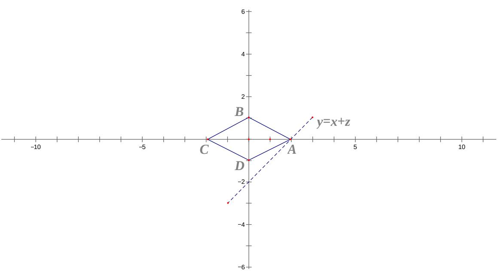

> [!faq]- 2012年上海高考数学真题（文科）试卷（word解析版）解析
>
> > [!success]- **【答案】** -2
>
> > [!note]- **【分析】**
> > 本题未单列分析。
>
> > [!note]- **【解析】**
> > 根据题意得到 $\left\{\begin{aligned}x\geq0,\\ y\geq0,\\ x+2y\leq2;\end{aligned}\right.$ 或 $\left\{\begin{aligned}x\geq0,\\ y\leq0,\\ x-2y\leq2;\end{aligned}\right.$ 或 $\left\{\begin{aligned}x\leq0,\\ y\geq0,\\ -x+2y\leq2;\end{aligned}\right.$
> >
> > $$
> > \left\{ \begin{array}{l} x \leq 0, \\ y \leq 0, \\ x + 2 y \geq - 2. \end{array} \right.
> > $$
> >
> > 其可行域为平行四边形 ABCD 区域，（包括边界）目标函数可以化成 $y = x + z$ ，z 的最小值就是该直线在 y 轴上截距的最小值，当该直线过点 $A(2,0)$ 时，z 有最小值，此时 $z_{\min}=-2$
> >
> >   
> > 【点评】本题主要考查线性规划问题, 准确画出可行域, 找到最优解, 分析清楚当该直线过
> >
> > 点 $A(2,0)$ 时，有最小值，此时 $z_{\min} = -2$ ，这是解题的关键，本题属于中档题，难度适中.
