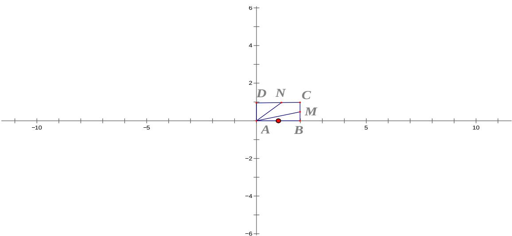

> [!faq]- 2012年上海高考数学真题（文科）试卷（word解析版）解析
>
> > [!success]- **【答案】** 详见解析
>
> > [!note]- **【分析】**
> > 本题未单列分析。
>
> > [!note]- **【解析】**
> > 【答案】 $\lfloor 1,4\rfloor$
> >
> > 图所示，因为 $x^{2} + bx + c = 0$ ，所以 $A(0,0), B(2,0), C(2,1)D(0,1)$ . 设
> >
> > $M(2,b), N(x,1), (0 \leq x \leq 2)$ ，根据题意， $b = \frac{2 - x}{2}$ ，所以
> >
> > $$
> > \vec {A N} = (x, 1), \vec {A M} = (2, \frac {2 - x}{2}).
> > $$
> >
> > 所以 $\vec{AM} \cdot \vec{AN} = \frac{3}{2}x + 1 (0 \leq x \leq 2)$ ，所以 $1 \leq \frac{3}{2}x + 1 \leq 4$ ，即 $1 \leq \vec{AM} \cdot \vec{AN} \leq 4$ .
> >
> > 
> >
> > 【点评】本题主要考查平面向量的基本运算、概念、平面向量的数量积的运算律.做题时，要切实注意条件的运用.本题属于中档题，难度适中.
