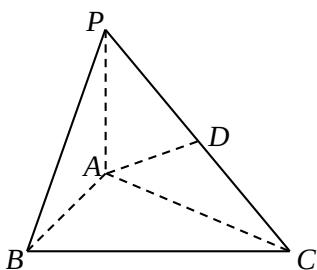

<!-- question-source:start -->
19. 如图，在三棱锥 $P - ABC$ 中， $PA \perp$ 底面 $ABC$ ， $D$ 是 $PC$ 的中点。已知 $\angle BAC = \frac{\pi}{2}$ ， $AB = 2$ ， $AC = 2\sqrt{3}$ ， $PA = 2$ 。求：

(1) 三棱锥 P-ABC 的体积；（6 分）

(2) 异面直线 $BC$ 与 $AD$ 所成的角的大小（结果用反三角函数值表示）. (6 分)

<!-- question-source:end -->

![[高中/真题/按年份分类/2012/2012年上海高考数学真题_文科_试卷_word解析版_/解答题/题目/answers/Q00023825A1.md]]
