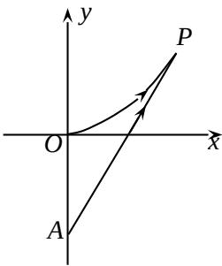

<!-- question-source:start -->
21. 海事救援船对一艘失事船进行定位: 以失事船的当前位置为原点, 以正北方向为 $y$ 轴正方向建立平面直角坐标系 (以 1 海里为单位长度), 则救援船恰在失事船的正南方向 12 海里 $A$ 处, 如图. 现假设: ①失事船的移动路径可视为抛物线 $y = \frac{12}{49} x^2$ ; ②定位后救援船即刻沿直线匀速前往救援; ③救援船出发 $t$ 小时后, 失事船所在位置的横坐标为 $7t$ .

（1）当 $t = 0.5$ 时，写出失事船所在位置 $P$ 的纵坐标.若此时两船恰好会合，求救援船速度的大小和方向；（6分）

(2) 问救援船的时速至少是多少海里才能追上失事船？（8 分）

<!-- question-source:end -->

![[高中/真题/按年份分类/2012/2012年上海高考数学真题_文科_试卷_word解析版_/解答题/题目/answers/Q00023827A1.md]]
