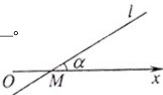

<!-- question-source:start -->
10. 如图，在极坐标系中，过点 $M(2,0)$ 的直线 l 与极轴的夹角 $\alpha=\frac{\pi}{6}$ ,

若将 l 的极坐标方程写成 $\rho = f(\theta)$ 的形式，则 $f(\theta) =$ \_\_\_\_。

<!-- question-source:end -->

![[高中/真题/按年份分类/2012/2012年上海高考数学真题_理科_试卷_word解析版_/填空题/题目/answers/Q00023272A1.md]]
