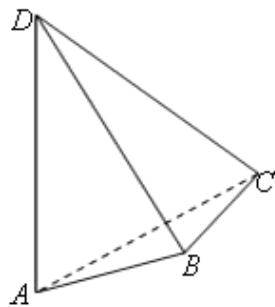

<!-- question-source:start -->
14. 如图，AD 与 BC 是四面体 ABCD 中互相垂直的棱，BC = 2，若 AD = 2c，且 $AB + BD = AC + CD = 2a$ ，其中 $a$ 、 $c$ 为常数，则四面体 $ABCD$ 的体积的最大值是 \_\_\_\_。

##
<!-- question-source:end -->

![[高中/真题/按年份分类/2012/2012年上海高考数学真题_理科_试卷_word解析版_/填空题/题目/answers/Q00028041A1.md]]
