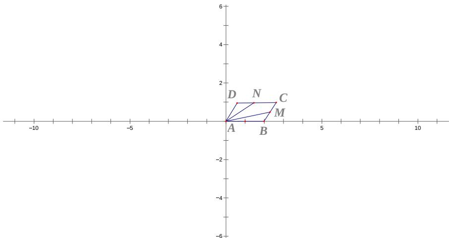

> [!faq]- 2012年上海高考数学真题（理科）试卷（word解析版）解析
>
> > [!success]- **【答案】** $\left\lfloor2,5\right\rfloor$
>
> > [!note]- **【分析】**
> > 本题未单列分析。
>
> > [!note]- **【解析】**
> > 以向量 AB 所在直线为 x 轴，以向量 AD 所在直线为 y 轴建立平面直角坐标系，如图所示，
> > 因为 AB = 2, AD = 1，所以 A(0,0), B(2,0), C( $\frac{5}{2}$ , 1) D( $\frac{1}{2}$ , 1). 设 $N(x,1)(\frac{1}{2} \leq x \leq \frac{5}{2})$ ，则 BM = $\frac{1}{2}$ CN，CN = $\frac{5}{2} - x$ ，BM = $\frac{5}{4} - \frac{1}{2}x$ ， $M(2 + \frac{5}{8} - \frac{1}{4}x, (\frac{5}{4} - \frac{1}{2}x)\sin\frac{\pi}{3})$ .
> > 根据题意，有 $\vec{AN}=(x,1),\vec{AM}=(\frac{21}{8}-\frac{x}{4},\frac{5\sqrt{3}-2\sqrt{3}x}{8})$ .
> > 所以 $\vec{AM}\bullet\vec{AN}=x(\frac{21}{8}-\frac{x}{4})+\frac{5\sqrt{3}-2\sqrt{3}x}{8}\left(\frac{1}{2}\leq x\leq\frac{5}{2}\right)$ ，所以 $2\leq\vec{AM}\bullet\vec{AN}\leq5.$
> >
> > 
> >
> > 【点评】本题主要考查平面向量的基本运算、概念、平面向量的数量积的运算律.做题时，要切实注意条件的运用.本题属于中档题，难度适中.
